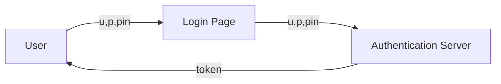
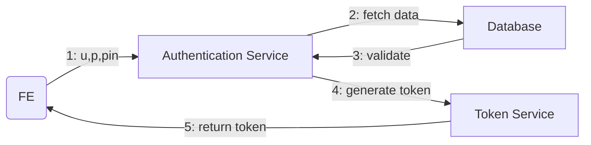
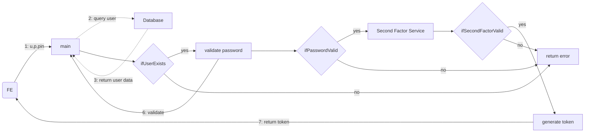
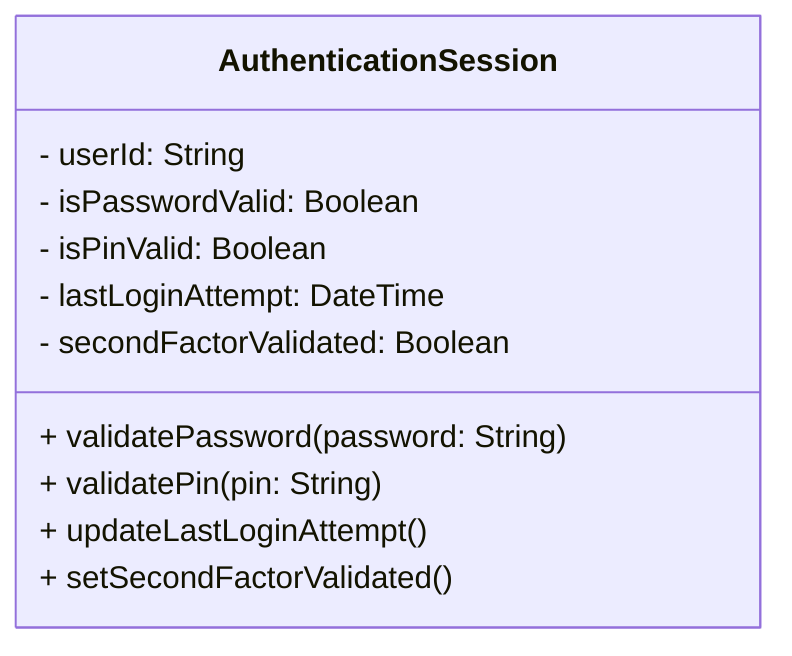

1. Q: The application is a MFA application. I need to be able to plot a diagram that illustrates the flow of the multi-factor authentication process. I need to know how to plot in mermaid first.

-> Quick task: Learn to plot in mermaid (tutorial) (estimate 20mins)

**First idea on authentication flow (system)**

**Full login flow with MFA (backend)**

*System flow:*

*Authentication Service flow:*

This is the initial idea of the backend flow for the multi-factor authentication process. I will focus on the first factor authentication at the beginning stage which is to handle username, password, and pin validation. The second factor will be handled after the first factor is validated successfully.

2. Q: I will briefly think about the backend with design and code logic. 

**Idea:** The backend should have an object to store current user's session information, including user's authentication status and any relevant timestamps for session management. As authenticating, that object will be updated to reflect the current state of the user's authentication process. and to have a clean program, those statuses should be handled modularly, with separate functions for each step of the authentication process. At the end of the program, one function would check if the object has all the necessary information to determine if the user is authenticated or not. A logging pipeline should also be implemented to track the flow of the authentication process.

**Object idea**

-> The last checkout function will validate all conditions and if all are met, it will return a successful authentication status. 

3. Let me think about the techs and stacks that can be implemented. 

A: Front end: I need 4 screens (login, register, second factor, and session status). I can use HTML, CSS, and JavaScript for the front end as they are simple and easy to implement.

B: Backend: I will use Flask for the backend framework. Flask is a good choice for simplicity and flexibility. I will add more techs that support the application.

C: Database: I will use SQLite for the database as it is lightweight and easy to set up. 

**Table of techs/stacks**

| Problem | Technology/Stack |
|---------|------------------|
| Frontend | HTML, CSS, JavaScript |
| Styling (optional) | Bootstrap |
| Craft request and receive response (frontend) | Axios or Fetch API |
| Backend | Flask |
| Query database | SQLAlchemy |
| Hashing | bcrypt |
| Token generation (optional) | PyJWT |
| Client-side token storage | HttpOnly cookies or localStorage (with caution) |
| Database | SQLite |
| Containerization | Docker |
| Database management | SQLite Studio |
| Testing | pytest | 
| Environment variables | python-dotenv |
---

# CODING SESSION TO TEST THE INITIAL IDEA

