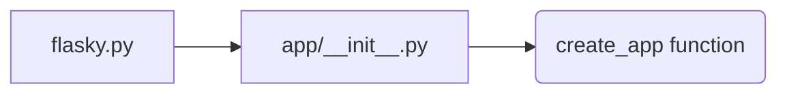
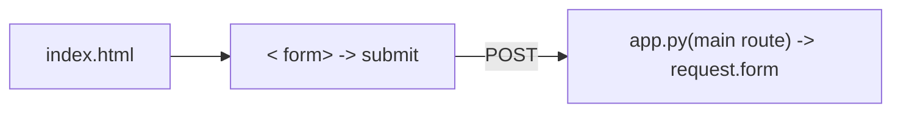
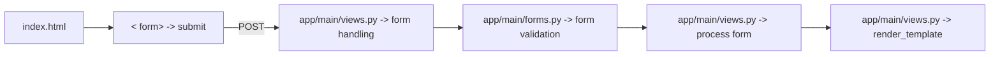
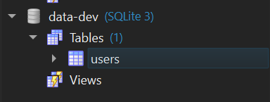

# First refactoring.

## 1. Project cleanup and environment setup

- Remove Binaries: remove sqldiff.exe, sqlite3.exe, etc. 
  
- Clean caches: add __pycache__ to .gitignore and remove all __pycache__ directories from the project.

- Dependency management: create requirements.txt file to lock in flask and other dependencies (pending)

**Environment setup:**

```shell
# create virtual environment
python -m venv venv

# activate virtual environment (PS)
venv\Scripts\activate
```

**Install dependencies:**

```bash
pip install Flask Flask-SQLAlchemy pytest
```

--> Add those dependencies to `requirements.txt`

```bash
pip freeze > requirements.txt
```

Run `pip install -r requirements.txt` to install dependencies in the future.

## 2. Database abstraction

- Introduce a database abstraction layer to separate database operations from the application logic. 

--> SQLAlchemy (a popular ORM for Python) will be implemented to handle database interactions.

### 2.1. Set up and configure SQLAlchemy

1. Update the `app.py` file to include SQLAlchemy configuration (temporary)

2. Try running the flask app -> Worked -> move to the next step

### 2.2. Creating models for the database tables

Generally, model is typically a Python class that match the columns of a corresponding database table.

1. Create a new file `models.py` to define the models for the database tables.

2. Link the models to the SQLAlchemy instance in `app.py`. 
Renaming `app.py` to `run.py` to avoid confusion from importing. It didn't solve the circular import issue -> the actual solution is to move the import of the User model to after the db is initialized in `run.py`.

### 2.3. Translating current queries to SQLAlchemy ORM queries

1. Access `query.py` and translate the current queries to SQLAlchemy ORM queries.

2. For a cleaner interaction, I will put the newly translated queries in a new file `orm_query.py` to avoid confusion with the old queries.

### 2.4. Session management

```
    db.session.add(user)
    db.session.commit()
```
these are used in `orm_query.py` to manage the session and commit changes to the database.

## 3. Modularization

- Split the application into multiple modules to improve maintainability and readability.

- Register blueprints for different parts of the application.

### 3.1. Folder structure established

```
|-flasky
  |-app/ -> create app folder to hold the application code
    |-templates/ -> move templates folder into app folder
    |-static/ -> create static folder to hold static files
    |-main/ -> create main folder to hold the blueprints
      |-__init__.py 
      |-errors.py
      |-forms.py
      |-views.py
    |-__init__.py
    |-email.py -> low priority, can be implemented later
    |-models.py -> move models.py into app folder
  |-migrations/ -> low priority, contains database migration scripts
  |-tests/ -> create test folder
    |-__init__.py
    |-test*.py
  |-venv/ -> already created via `python -m venv venv`
  |-requirements.txt -> already created
  |-config.py -> Create config.py to store configuration settings
  |-flasky.py -> Change run.py to flasky.py
  |-TP/ -> create TP folder to hold team project files
  |-legacy/ -> create legacy folder hold the old code that now is refactored into the new structure
```

*Adopted from Flask Web Development, 2nd Edition*

**app/__init__.py**:
This file will contain the application factory function to create and configure the Flask application instance. In order words, it will be the entry point of the application.

Current flow is:



In the original approach, the application instance was created directly in `flasky.py`, which makes routing simple by using `@app.route` decorators. After implementing this change, the application instance is created at runtime, `@app.route` only exists after `create_app` is invoked. It is too late for `@app.route` decorators to register routes. 

To solve the upper problem, Flask provides Blueprints, which allow us to organize the application into modules and register routes after the application instance is created.

This approach is more flexible and allows better organization for the code structure. It also makes it easier to test and maintain the application.

**app/main/__init__.py**: main blueprint creation

After creating the main blueprint, we need to register it in the application factory function in `app/__init__.py`

After that, we can create `app/main/errors.py`, and `app/main/views.py` to handle the routes and error pages.

At this point of refactoring, I am introduced with the concept of WTForms, which is a FLask extension that simplifies form handling and validation. I will use it to handle the form in `app/main/views.py`.

Original flow



New flow



At this step, I will need to create a `forms.py` file in the `app/main/` directory to define the form class and its validation rules.

Install Flask-WTF to handle forms:

```bash
pip install flask-wtf
```

I also learned that Flask renders templates using Jinja2 engine. This means that the template HTML files can contain dynamic content and logic using Jinja2 syntax. I don't have to follow the original approach of using `request.form` ot access form data.

A useful option for styling in Flask is to use Flask-Bootstrap, which integrates Bootstrap framework with Flask. It provides a set of templates and macros that make it easier to create responsive and visually appealing web pages.

I put the main script into `flasky.py` which invokes the `create_app` function to create the application instance to test the refactored code.

Set environment Flask variable:

```bash
set FLASK_APP=flasky.py
set FLASK_DEBUG=1
```

`python flasky.py` runs the application without returning any error. The pipeline worked, now I can proceed to implement further refactoring and testing.

A `basic_tests.py` file is created in the `tests/` folder. **Caution** the name of the file must start with `test_` for pytest to discover the tests.

Took me a while wiring the frontend to blueprint, it has not yet implement bootstrap styling. I will implement it later. Now I will focus on implementing the database so that I can test the login and registration functionality.

First thing to do is to create the table that defined in the `models.py` file. It can be done via `flask --app flasky shell` command, then run `db.create_all()` to create the table (users) in the database.


**Database interaction**

This part is where I will try to work with the database using SQLAlchemy ORM queries.

From the earlier step, I created the table in the database, how can I verify if the table is created successfully? I can create a unit test to check that. 



The table was created successfully after running the command in the flask shell. Now I can implement the registration and login functionality using SQLAlchemy ORM queries.

For simplicity, I will implement the registration and login functionality in the `app/main/views.py` file. I will create a new file `orm_query.py` to hold the SQLAlchemy ORM queries for user registration and login.

*Registration*

Caution: Must use `{{ form.hidden_tag() }}` in the templates to include the CSRF token for form submission. Otherwise, the form will not be valid.

CSRF is an important piece in cybersecurity to securing your application from Cross-Site Request Forgery attacks.

This module cost me a lot of time due to a stupid mistake by invoking `User()` class and `create_user()` function at the same time. `create_user()` function is already creating a new User instance, so I don't need to create a new User instance in the `views.py` file. The registration functionality is working now, I can proceed to implement the login functionality.

*Login*
The login pipeline is working now. Now there is one missing piece, which is the session management. Currently, I cannot keep track of the logged-in user. 

**Session management**

This application use flask-login to have a full session management functionality. 

*Update User model:* I need to update the User model with the `UserMixin` class to provide authentication methods and properties for the User model.

*LoginManager:* is added to the application `__init__.py` to handle user sessions.

Add the `@login_required` decorator to the index route to restrict access to authenticated users only. Now we need to implement the login function in the `views.py` via `login_user()`.

After all those steps, the user is now can be authenticated and logged in. The session management is working now, I can proceed to implement the logout functionality. 

Add a `/logout` route to the `views.py` file to handle user logout via `logout_user()` function.

Everthing is working now. However, there are things that I need to improve:
- Implement navigation for the user to navigate between frontend pages.
- Migrate user validating and authentication to `forms.py` file, leaving the `views.py` file to handle the routing and rendering templates only.
- Improve the error handling and flash messages to help the user to understand what is going on in the application.

**Frontend**
- Implement bootstrap, wtf for navigation.
- Supporting documents: https://www.geeksforgeeks.org/python/template-inheritance-in-flask/
  
**Form classes**
- `RegistrationForm` class to handle user registration form and validation.
-> Audit `forms.py` file to validate the form fields
-> Move hash logic to `models.py` file. Password hashing follows book's intruction works -> move on to implement pin hashing in `models.py` file. After this step, the records of hashed password and pin are stored in the database on registration, however, the current login logic in `views.py` allows me to print the plaintext password and pin to the console. I think this is a security issue, and needed to be working on.
-> Audit `views.py` by removing the plaintext password and pin from the console printout. Also, rip off the hashing and verification logic from `views.py`. They both work now. I book introduces `flash` function to display the message to the user, I will try to implement it in the next step. This is the source I found from flask documentation: https://flask.palletsprojects.com/en/stable/patterns/flashing/
-> manage "flash" messages to display the message to the user. The loop works well, now let's move to refactoring the login loop accordingly.
-> Everything works well now. 
NEXT STEP:
1. Implement second factor authentication (2FA) using email verification.
2. Implement testing suite to test the application functionality.
3. Improve the code quality and maintainability by refactoring the codebase.


## 4. Implementing testing suite

- Create a test folder and use pytest to write unit tests.

- Run the tests to ensure that the application behaves as expected.